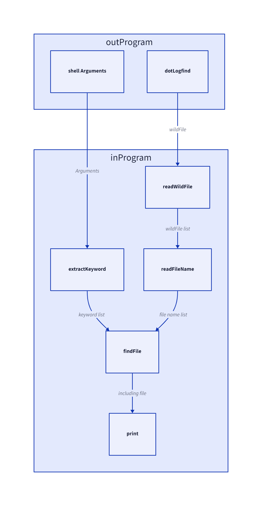

# logfind

The Linux program for finding keywords from files   

Build:   
>__In Linux enviorment__   
>cmake -D CMAKE_C_COMPILER=(your C compiler) -D CMAKE_CXX_COMPILER=(your C++ compiler) .   
>make

Usage:     
>./logfind (keyword1) (keyword2) [-o: AND option]    
>__Program requires .logfind file__  

Way of writing .logfind file:
>*.(file extension)   
>(one of the file names)

Example usage:    
    
__./logfind hello__, It will print files including "hello".    
__./logfind hello my -o__, It will print files including "hello" and "my"

Example .logfind:

  

Architecture:   

</img> 

