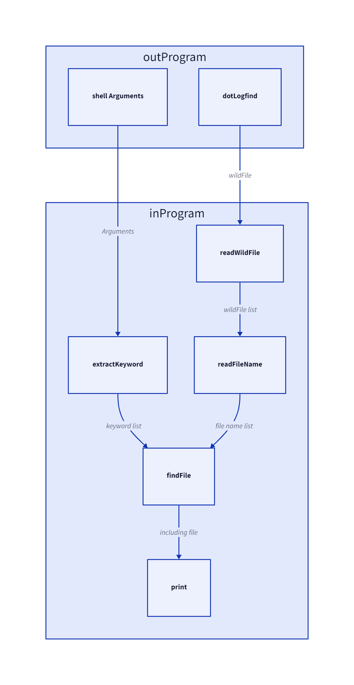

# logfind

Linux program for searching keywords form files   

Usage:     
    
>./logfind (keyword) (keyword) [-o: AND option]    
>__Program requires .logfind file__  

Way of writing .logfind file:
>*.(file extension)   
>(one of the file names)

Example usage:    
    
__./logfind hello__, It will print files including "hello".    
__./logfind hello my -o__, It will ptrit files includg "hello" and "my"

Example .logfind:

  

Architecture:   

</img> 

